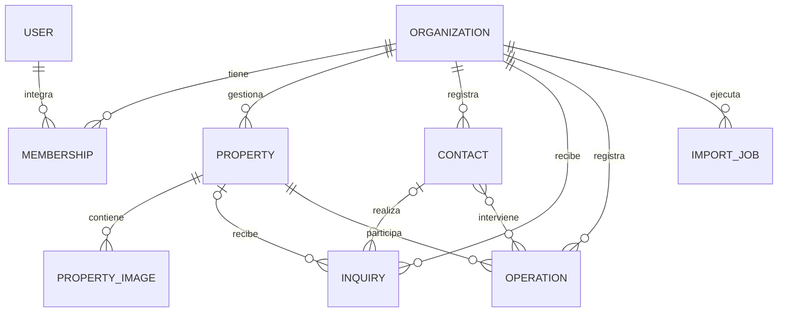

# Dominio inicial

Este documento define el vocabulario mínimo compartido. No especifica tablas, columnas ni una arquitectura DDD.

## Organization

Representa una inmobiliaria y es la raíz del tenant. Los recursos privados se vinculan a una organización.

## User

Usuario autenticado de la plataforma, cuya identidad es administrada por Supabase Auth en `auth.users`. InmoCore no mantiene una tabla propia de usuarios o perfiles mientras no existan datos adicionales que lo requieran. Su acceso a una organización se determina mediante una membresía.

## Membership

Relaciona un usuario con una organización. Los roles iniciales son `OWNER`, `ADMIN` y `AGENT`; el MVP no incluye permisos dinámicos.

## Property

Inmueble gestionado por una organización.

- Operación: venta o alquiler.
- Tipo: casa, departamento, terreno, local, oficina, quinta, cochera u otro.
- Estado comercial: `draft`, `available`, `reserved`, `sold`, `rented` o `archived`.
- Información mínima: referencia, título, descripción, precio, moneda, ubicación, características principales, superficies, estado de publicación y condición de destacada.

Las amenities no se modelan inicialmente como un conjunto exhaustivo de columnas.

## PropertyImage

Imagen perteneciente a una propiedad. Las imágenes tienen un orden y una puede funcionar como portada.

## Contact

Persona relacionada con la inmobiliaria. Puede actuar en varios contextos, como propietario, comprador, interesado o inquilino, por lo que no queda limitada por un único `contactType`. No representa un CRM avanzado.

## Inquiry

Consulta o expresión de interés de un contacto o potencial contacto. Puede asociarse a una propiedad.

- Origen: `website`, `whatsapp`, `instagram`, `phone`, `referral` u `other`.
- Estado: `new`, `contacted`, `interested`, `visit`, `negotiation`, `closed` o `lost`.

## Operation

Venta o alquiler cerrado, relacionado con una propiedad y una organización. Puede involucrar contactos relevantes y registra tipo, valor, moneda, fecha, comisión y agente responsable. No incluye contabilidad.

## ImportJob

Importación de propiedades mediante Excel o CSV. Registra el archivo, estado, cantidad procesada, cantidad creada y errores. La definición del motor de importación queda para su milestone.

## Relaciones centrales

## Reglas fundamentales

- Todo recurso privado pertenece directa o inequívocamente a una organización.
- Una organización nunca accede a información de otra.
- Una propiedad puede existir sin estar publicada.
- Una venta o alquiler cerrado afecta el estado comercial de la propiedad.
- Las operaciones preservan el historial y no se reemplazan por el estado actual de la propiedad.
- Una consulta no necesariamente termina en una operación.
- Una importación aplica las mismas validaciones de negocio que la carga manual.
